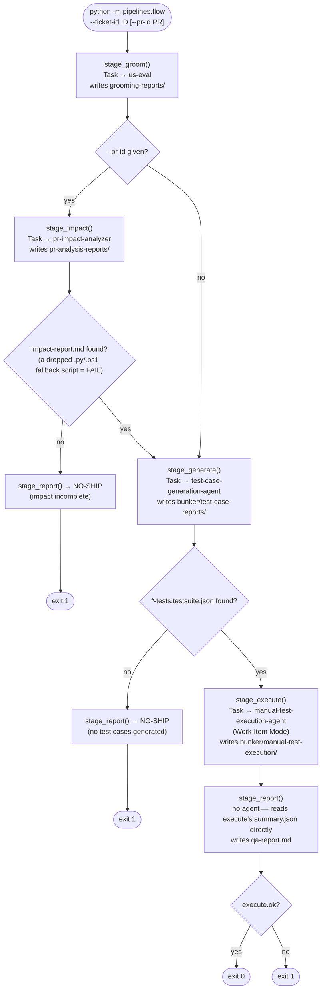

# AutoTest — two ways to run

A generic, PM-tool-agnostic QA pipeline template with no application knowledge baked in, plus a
web dashboard for configuring it and browsing pipeline results.

## Dashboard

```
cd dashboard && npm install && npm run build && cd ..
python3 -m pipelines.api
```

Opens `http://127.0.0.1:8765` in your browser. Three pages, one Python backend (stdlib
`http.server`, no dependencies to install beyond Python itself):

- **Tickets** — every work item that's had at least one pipeline stage run against it, with an
  overall pass/fail/pending status. Click into one for a tab per stage (groom, PR impact,
  cross-system impact, generate, execute, report) showing that stage's real structured output —
  readiness scores, ship-risk, regression risks, generated test cases, pass/fail counts with
  screenshots — read straight from the `summary.json`/`testsuite.json` files each agent already
  writes under `bunker/`.
- **Traces** — a visual waterfall of any `flow.py` run (stages, agent calls, durations, cost,
  tool calls), read from the `trace.jsonl` files `pipelines/tracing.py` writes; see "Quality
  evals" and "Known risks" below for how that data is captured.
- **Configure** — the form that writes `pipeline.config.json` (your apps, environments, PM
  tool). See [`docs/CONFIGURATION.md`](docs/CONFIGURATION.md) for the full field reference, or
  edit [`pipeline.config.example.json`](pipeline.config.example.json) by hand if you prefer.

This template ships one working reference backend adapter, TFS/Azure DevOps — see
[`docs/adapters/tfs.md`](docs/adapters/tfs.md).

The dashboard's frontend (`dashboard/`) is a Vite + React + TypeScript app; `npm run build` is a
one-time step (rerun it after pulling frontend changes). For frontend development with hot
reload, run `npm run dev` inside `dashboard/` instead — it proxies API calls to the Python
backend on port 8765 (see `dashboard/vite.config.ts`).

Two implementations live here. **They are not equivalent** — pick the one that matches what you're doing.

## 1. Interactive playbook — `PIPELINE.md` ← the real, full sequence

Claude drives this live inside a Claude Code session (live browser, live DB, judgement calls).

```
run QA pipeline on <ticket-id>      (or)      /qa-pipeline <ticket-id>
```

Stages: **groom+evaluate → PR impact → cross-system impact → generate → execute live →
backend verification → report → publish to your PM tool (one confirmation gate)**. Auto-detects
the environment from the ticket's linked PR branch; needs only the work-item id.

**To change the sequence, edit `PIPELINE.md`** — not this file, not the command.

## 2. Headless script — `flow.py` (partial, never run end-to-end)

```
python3 -m pipelines.flow --ticket-id <id> [--pr-id <id>]
```

A narrower subset — **no cross-system-impact stage, no backend verification, no PM-tool
publish** (no `--publish` flag, no PR comments, no test-result uploads). Every stage delegates to
the same agents the slash-commands use (`.claude/agents/*.md`), via `subagent_type` identifiers
overridable in `pipeline.config.json`'s `agents` block. Artifacts land in
`artifacts/flow/<ticket_id>/`.

### Call flow (`flow.py::main`)



`stage_report()` never calls an agent and never auto-approves a ship decision — it just synthesizes
`qa-report.md` from what the prior stages produced.

## Quality evals (opt-in, off by default)

`pipelines/evals.py` wires two deepeval LLM-judge metrics into `flow.py`, picked to guard the
pipeline's two costliest failure modes rather than built as a general framework:

- **Groundedness** (a custom G-Eval) on `stage_generate` — judges the generated test cases
  against the story's real acceptance criteria (read from `stage_groom`'s `.md` artifact), to
  catch invented screens/fields/business rules.
- **Summarization** on `stage_report` — judges `qa-report.md` against `execution_log.json`, to
  catch a ship/no-ship writeup that misrepresents what execution actually found.

Both are **report-only, not a gate** — a low score is logged to stdout and to the run's
`trace.jsonl` (under each stage's span metadata), but does not fail the stage or flip the
ship/no-ship call. Thresholds are the deepeval defaults (0.5), uncalibrated against any real run
so far; treat scores as a new signal to watch, not a verdict to trust yet.

**The judge model is NOT deepeval's built-in `AnthropicModel`.** That requires a standalone
Anthropic Console API key, which not every org grants self-serve. Instead
`pipelines/evals.py::_ClaudeAgentSdkModel` is a small custom `DeepEvalBaseLLM` that reuses the
SAME Claude Agent SDK auth every other stage in this pipeline already depends on — no separate
key needed. One live wrinkle it works around: if `ANTHROPIC_API_KEY` happens to be set in the
shell (even to an invalid value), the Claude CLI's own precedence rules make it shadow the
working claude.ai login and the call hangs/fails — verified in this exact environment. The model
passes `env={"ANTHROPIC_API_KEY": ""}` to neutralize that for just its own subprocess, without
touching the calling process's environment. This is scoped to the eval judge only — it is
deliberately NOT applied in `pipelines/common.py::run_agent`'s four real pipeline stages; if you
hit the same shadowing symptom there, that's a separate call to make, not an automatic fix.

Enable with:

```powershell
$env:PIPELINE_EVALS = "1"                      # off unless set — every call is a real judge request
$env:PIPELINE_EVAL_MODEL = "claude-sonnet-5"   # optional override, this is already the default
```

No API key to set — auth comes from the same Claude Agent SDK login `run_agent` already uses.
If `PIPELINE_EVALS=1` but `claude_agent_sdk` isn't installed, the judge call isn't authenticated,
or it fails for any other reason (rate limit, network, `max_turns` cutoff), each eval degrades to
an `EvalOutcome(success=False, score=None, reason="eval judge call failed: ...")` — it never
raises into the stage. `None` (not attempted — evals disabled) and a `success=False` outcome
(attempted, and either judged ungrounded/unfaithful or the judge call itself failed) are
distinguished in `reason`, so a disabled-evals run and a failed-judge-call run don't look alike
in the trace.

Note deepeval has its own PostHog analytics call on `metric.measure()` (observed as a
"[PostHog] analytics lane flush" message) — unrelated to the Anthropic judge call, and not
something this seam controls; it is deepeval's own library telemetry, not ticket/PR content.

## Known risks (flow.py only)

- Never run end-to-end. Field names were checked against the installed `claude_agent_sdk`, but that's static verification, not a real run.
- `max_turns` (40 groom/impact, 80 generate, 200 execute) are rough guesses — `stage_execute` especially can need more given per-step Playwright round-trips.
- Runs every stage with `permission_mode="bypassPermissions"` — point this only at sandbox/non-prod data.
- Treats the impact stage's sandboxed-shell fallback (agent writes a script for a human to run) as a hard failure rather than simulating that human.

## Not done here

No CI/CD pipeline or service-hook changes, no `--publish` mode, no PM-tool writes, no PR
comments, no packages installed or env vars set beyond what's documented above.
