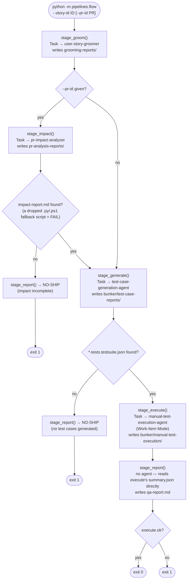

# QA pipeline — two ways to run

Two implementations live here. **They are not equivalent** — pick the one that matches what you're doing.

## 1. Interactive playbook — `PIPELINE.md` ← the real, full sequence

Claude drives this live inside a Claude Code session (live browser, live DB, judgement calls).

```
run QA pipeline on <story-id>      (or)      /qa-pipeline <story-id>
```

Stages: **groom+evaluate → PR impact → CCT cross-center impact → generate → execute live →
DB verification (preview) → report → publish to TFS (one confirmation gate)**. Auto-detects the
environment from the story's linked PR branch; needs only the work-item id.

**To change the sequence, edit `PIPELINE.md`** — not this file, not the command.

## 2. Headless script — `flow.py` (partial, never run end-to-end)

```
python3 -m pipelines.flow --story-id <id> [--pr-id <id>]
```

A narrower subset — **no CCT stage, no DB verification, no TFS publish** (no `--publish` flag, no
PR comments, no test-result uploads). Every stage delegates to the same agents the slash-commands
use (`.claude/agents/*.md`). Artifacts land in `artifacts/flow/<story_id>/`.

### Call flow (`flow.py::main`)



`stage_report()` never calls an agent and never auto-approves a ship decision — it just synthesizes
`qa-report.md` from what the prior stages produced.

## Known risks (flow.py only)

- Never run end-to-end. Field names were checked against the installed `claude_agent_sdk`, but that's static verification, not a real run.
- `max_turns` (40 groom/impact, 80 generate, 200 execute) are rough guesses — `stage_execute` especially can need more given per-step Playwright round-trips.
- Runs every stage with `permission_mode="bypassPermissions"` — point this only at sandbox/non-prod data.
- Treats the impact stage's sandboxed-shell fallback (agent writes a script for a human to run) as a hard failure rather than simulating that human.

## Not done here

No Azure DevOps pipeline/service-hook changes, no `--publish` mode, no TFS writes, no PR comments,
no packages installed or env vars set beyond what's documented above.
